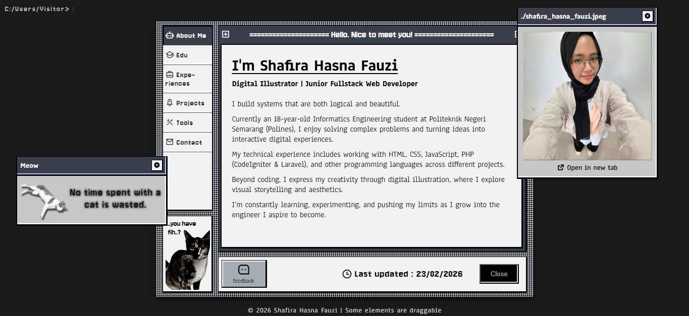
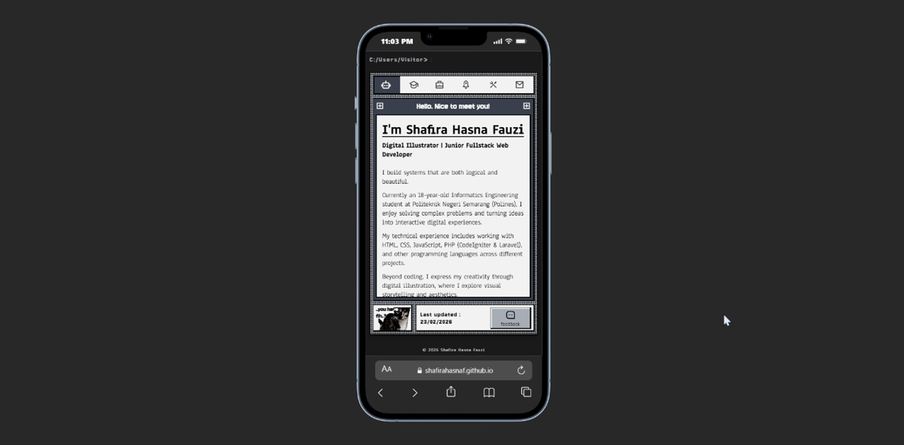

## Shafira Hasna Fauzi's Personal Website

a retro-styled personal website with draggable windows, referenced by old windows UI

## LIVE DEMO
[https://shafirahasnaf.github.io/shafirahf/](https://shafirahasnaf.github.io/shafirahf/)

## FEATURES
- Draggable modal (desktop only)
- Mobile friendly
- Feedback form
- Clicky SFX
- Hidden easter eggs

## TECH STACKS
- HTML
- CSS
- Vanilla Javascript
- [Sheet.best](https://sheet.best)
- [Matter.js](https://brm.io/matter-js/)

## SCREENSHOTS

---

your feedback helps me improve! Whether it's bug reports, feature suggestions or questions about the code. Please use the feedback form or GitHub Issues.

thanks for visiting! 😉

Shafira Hasna F. 2026
